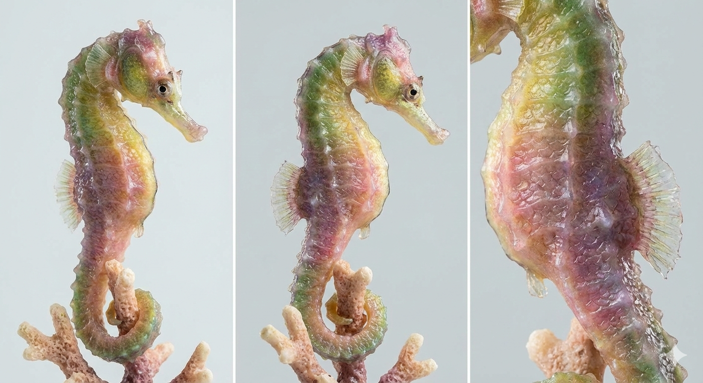
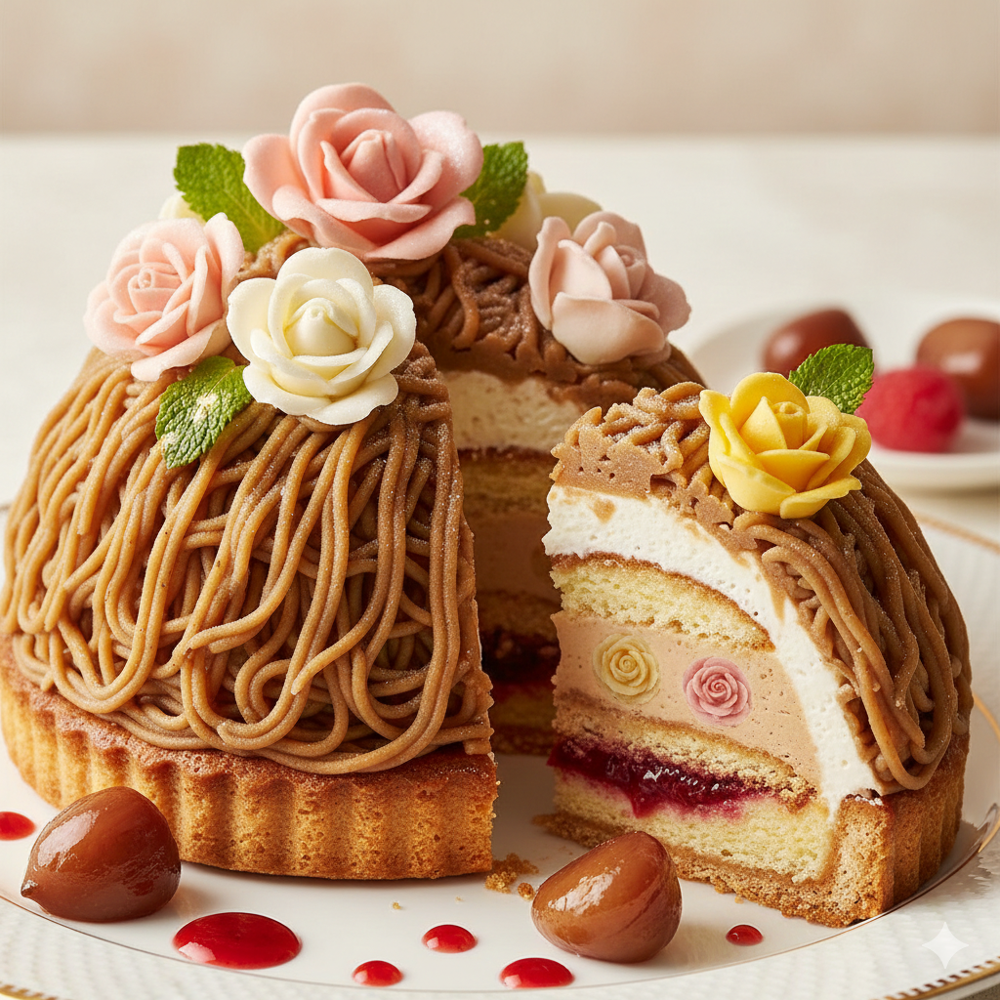
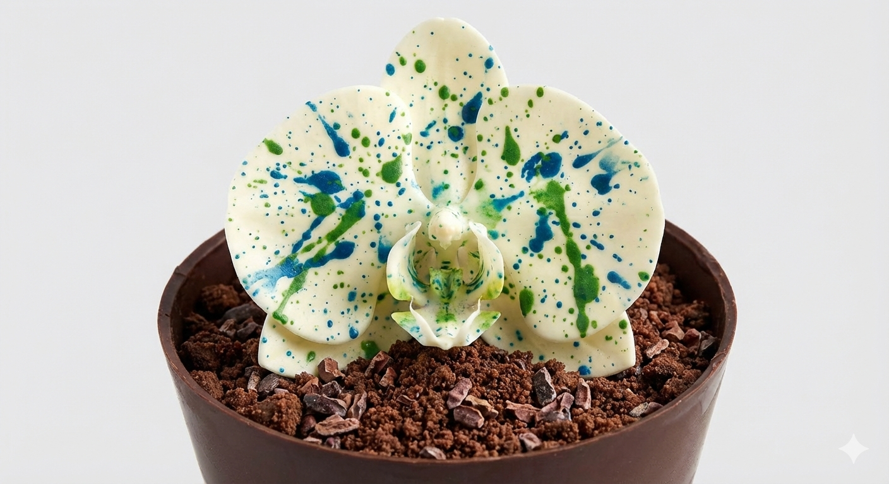

<!DOCTYPE html>
<html lang="es">
<head>
<meta charset="UTF-8">
<meta name="viewport" content="width=device-width, initial-scale=1.0">
<title>Jenny Cabrera – Edible Art Gallery</title>

<link rel="preconnect" href="https://fonts.googleapis.com">
<link rel="preconnect" href="https://fonts.gstatic.com" crossorigin>
<link href="https://fonts.googleapis.com/css2?family=Cormorant+Garamond:wght@300;400;500;600&display=swap" rel="stylesheet">

</head>

<body>

🌊

🌺

🦋

<section class="hero">
    

        

            <!-- Tu SVG original intacto -->
        

        <h1>JENNY CABRERA</h1>
        
EDIBLE ART GALLERY

    

    
↓

</section>

<section class="gallery">

<article class="art-piece">
    

        
    

    

        <h3 class="art-title">Fantasía Marina Efímera</h3>
        

            Escultura de azúcar soplado y modelado a mano que captura la iridiscencia marina.
        

    

</article>

<article class="art-piece">
    

        
    

    

        <h3 class="art-title">Corazón Floreal Oculto</h3>
        

            Pétalos de rosa y crema floral envueltos en castaña tibia.
        

    

</article>

<article class="art-piece">
    

        
    

    

        <h3 class="art-title">Orquídea Pollock</h3>
        

            Chocolate plástico pintado a mano en una explosión expresionista.
        

    

</article>

</section>

</body>
</html>
